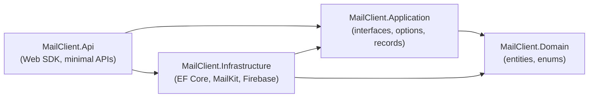

# Architecture Reference (English)

> Türkçe: [ARCHITECTURE.tr.md](ARCHITECTURE.tr.md)

## Project dependency structure

- `Domain` has no references: safe to reference from everywhere, contains
  only `Entities/` (9 classes) and `Enums/` (`UserRole`, `UserStatus`,
  `MailSecurity`, `MailFolderType`, `SendOperationStatus`).
- `Application` depends only on `Domain`: all seams live here:
  `Interfaces/` (account, folder, read, query, send, devices, push, auth,
  admin, session, JWT issuer, health, storage, credential protector,
  connectivity tester, folder explorer, DNS/host validators), `Sync/`
  (`MailSyncOptions`, `SendRequestLimits`), `Auth/PasswordPolicy`,
  `Validation/`, `Network/` (`MailServerEndpoint`, `MailConnectionFailure`,
  `SmtpDeliveryException`), `ServiceResult` + `ServiceOutcome`.
- `Infrastructure` implements the seams: `Persistence/` (`AppDbContext`,
  `Configurations/`, `DbUniqueViolation`), `Services/` (account, folder,
  sync, read, query, send, locks, failure policy, idempotency store),
  `Email/` (MailKit adapters, builders, mappers, classifiers),
  `Push/` (Firebase chain + devices), `Storage/` (`LocalFileStorage`,
  `BoundedWriteStream`), `Network/` (DNS, SSRF validator), `Identity/`
  (auth, admin, session), `Security/` (Data Protection protector).
- `Api` is HTTP only: `Program.cs` wiring + endpoint mappers
  (`Auth/`, `Accounts/`, `Mails/`, `Devices/`, `Health/`). No business logic.

## Dependency-injection boundaries

`Program.cs` registers abstractions with scoped implementations per request
(`IMailAccountService → MailAccountService`, …); singletons are stateless or
validated options (`MailSyncOptions`, `FirebaseOptions`, `IJwtTokenIssuer →
JwtTokenIssuer`, `IDnsResolver`, `IOutboundHostValidator`); the sync worker
and push fan-out open their own scopes (`IServiceScopeFactory`) so background
work never shares a request `DbContext`.

Key interface → implementation map:

| Abstraction | Implementation | Notes |
|---|---|---|
| `IAuthenticationService` | `AuthenticationService` | register/login, unique-violation mapping |
| `IUserAdministrationService` | `UserAdministrationService` | list/create/status/reset, bumps `TokenVersion` |
| `IUserSessionValidator` | `UserSessionValidator` | per-request session check |
| `IJwtTokenIssuer` | `JwtTokenIssuer` | `sub`/`role`/`tv` claims, 12 h |
| `IMailAccountService` / `IMailFolderService` | same-named | accounts, discovery, refresh |
| `IMailQueryService` / `IMailReadService` | same-named | lists/detail/download, two-way read flags |
| `IMailSendService` | `MailSendService` + `SendOperationStore` | MIME + SMTP + idempotency |
| `IMailTransport` | `MailKitMailTransport` | SMTP via MailKit |
| `IMailFolderClient` | `MailFolderClient` | scoped IMAP folder use (+ update lock) |
| `IMailFolderExplorer` / `IMailConnectivityTester` | `MailKit*` | discovery / test |
| `ICredentialProtector` | `DataProtectionCredentialProtector` | mailbox password encryption |
| `IFileStorage` | `LocalFileStorage` | traversal-pinned local files |
| `IPushNotificationService` | `FirebasePushNotificationService` / `NoOp…` | enabled flag selects |
| `IFirebaseGateway` | `FirebaseAdminGateway` | result → keep/remove mapping |
| `IFirebaseMessageSender` | `FirebaseMessageSender` | 500-chunks, `SendEachAsync` |
| `IDeviceTokenService` | `DeviceTokenService` | register/reassign/delete |
| `IHealthProbe` | `DatabaseHealthProbe` | Postgres check |
| `IOutboundHostValidator` / `IDnsResolver` | `OutboundHostValidator` / `SystemDnsResolver` | SSRF layer |

## External dependencies

PostgreSQL (state), IMAP servers (source of truth), SMTP servers (delivery),
FCM (push), local filesystem (attachments, key ring). Background work is an
in-process hosted service; there is no Redis, queue, or object store, so
scale-out requires shared Postgres (advisory locks coordinate) plus shared
storage and a shared Data Protection ring.

## Lifecycles

HTTP pipeline, auth, sync, send, push, and device flows are diagrammed in
[BACKEND_GUIDE.en.md](BACKEND_GUIDE.en.md) (§3, §6, §8, §9, §12).

Database ER diagram: [BACKEND_GUIDE.en.md](BACKEND_GUIDE.en.md) §11.

## Data lifecycle summary

IMAP server → (sync worker) → Postgres + disk → (HTTP) → Flutter;
Flutter → (send endpoint) → SMTP server (+ Sent APPEND → re-synced);
new Inbox rows → (post-commit) → FCM → Flutter refetch.
Credentials flow one way: request → Data Protection → DB; decrypted only
inside short-lived mail operations.
