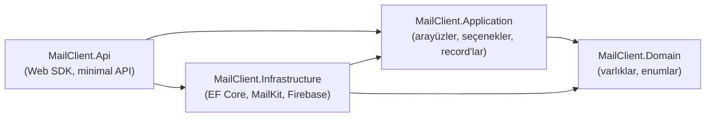

# Mimari Referansı (Türkçe)

> English: [ARCHITECTURE.en.md](ARCHITECTURE.en.md)

## Proje bağımlılık yapısı

- `Domain`'in referansı yok: her yerden güvenle referans verilir; yalnızca
  `Entities/` (9 sınıf) ve `Enums/` (`UserRole`, `UserStatus`,
  `MailSecurity`, `MailFolderType`, `SendOperationStatus`) içerir.
- `Application` yalnız `Domain`'e dayanır: tüm dikişler burada —
  `Interfaces/` (hesap, klasör, okuma, sorgu, gönderim, cihazlar, push, auth,
  admin, oturum, JWT üretici, sağlık, depolama, parola koruyucu, bağlantı
  test edici, klasör gezgini, DNS/host doğrulayıcılar), `Sync/`
  (`MailSyncOptions`, `SendRequestLimits`), `Auth/PasswordPolicy`,
  `Validation/`, `Network/` (`MailServerEndpoint`, `MailConnectionFailure`,
  `SmtpDeliveryException`), `ServiceResult` + `ServiceOutcome`.
- `Infrastructure` dikişleri gerçekler: `Persistence/` (`AppDbContext`,
  `Configurations/`, `DbUniqueViolation`), `Services/` (hesap, klasör,
  senkron, okuma, sorgu, gönderim, kilitler, hata politikası, idempotency
  deposu), `Email/` (MailKit adaptörleri, builder'lar, mapper'lar,
  sınıflandırıcılar), `Push/` (Firebase zinciri + cihazlar), `Storage/`
  (`LocalFileStorage`, `BoundedWriteStream`), `Network/` (DNS, SSRF
  doğrulayıcı), `Identity/` (auth, admin, oturum), `Security/` (Data
  Protection koruyucu).
- `Api` yalnızca HTTP'tir: `Program.cs` bağlantıları + uç nokta eşleyiciler
  (`Auth/`, `Accounts/`, `Mails/`, `Devices/`, `Health/`). İş mantığı yok.

## Dependency-injection sınırları

`Program.cs` soyutlamaları istek başına scoped gerçeklemelerle kaydeder
(`IMailAccountService → MailAccountService`, …); singleton'lar durumsuz veya
doğrulanmış seçeneklerdir (`MailSyncOptions`, `FirebaseOptions`,
`IJwtTokenIssuer → JwtTokenIssuer`, `IDnsResolver`,
`IOutboundHostValidator`); senkron işçisi ve push dağıtımı kendi scope'unu
açar (`IServiceScopeFactory`), arka plan işi istek `DbContext`'ini asla
paylaşmaz.

Temel arayüz → gerçekleme tablosu:

| Soyutlama | Gerçekleme | Not |
|---|---|---|
| `IAuthenticationService` | `AuthenticationService` | kayıt/giriş, unique-çatışma eşleme |
| `IUserAdministrationService` | `UserAdministrationService` | listele/oluştur/statü/sıfırla, `TokenVersion` artırır |
| `IUserSessionValidator` | `UserSessionValidator` | istek başına oturum kontrolü |
| `IJwtTokenIssuer` | `JwtTokenIssuer` | `sub`/`role`/`tv` claim'leri, 12 sa |
| `IMailAccountService` / `IMailFolderService` | aynı adlı | hesaplar, keşif, yenileme |
| `IMailQueryService` / `IMailReadService` | aynı adlı | liste/detay/indir, çift yönlü okundu |
| `IMailSendService` | `MailSendService` + `SendOperationStore` | MIME + SMTP + idempotency |
| `IMailTransport` | `MailKitMailTransport` | MailKit ile SMTP |
| `IMailFolderClient` | `MailFolderClient` | kapsamlı IMAP klasör kullanımı (+ güncelleme kilidi) |
| `IMailFolderExplorer` / `IMailConnectivityTester` | `MailKit*` | keşif / test |
| `ICredentialProtector` | `DataProtectionCredentialProtector` | kutu parola şifreleme |
| `IFileStorage` | `LocalFileStorage` | kaçış korumalı yerel dosyalar |
| `IPushNotificationService` | `FirebasePushNotificationService` / `NoOp…` | enabled bayrağı seçer |
| `IFirebaseGateway` | `FirebaseAdminGateway` | sonuç → koru/sil eşleme |
| `IFirebaseMessageSender` | `FirebaseMessageSender` | 500'lü parça, `SendEachAsync` |
| `IDeviceTokenService` | `DeviceTokenService` | kaydet/transfer/sil |
| `IHealthProbe` | `DatabaseHealthProbe` | Postgres kontrolü |
| `IOutboundHostValidator` / `IDnsResolver` | `OutboundHostValidator` / `SystemDnsResolver` | SSRF katmanı |

## Dış bağımlılıklar

PostgreSQL (durum), IMAP sunucuları (doğruluk kaynağı), SMTP sunucuları
(teslim), FCM (push), yerel dosya sistemi (ekler, anahtar halkası). Redis,
kuyruk, nesne deposu yok — arka plan işi süreç-içi hosted servistir; ölçek
genişletme paylaşımlı Postgres (advisory lock'lar koordine eder) + paylaşımlı
depolama ve paylaşımlı Data Protection halkası gerektirir.

## Yaşam döngüleri

HTTP hattı, auth, senkron, gönderim, push ve cihaz akışları
[BACKEND_GUIDE.tr.md](BACKEND_GUIDE.tr.md) (§3, §6, §8, §9, §12) bölümünde
diyagramlıdır. Veritabanı ER diyagramı: §11.

## Veri yaşam döngüsü özeti

IMAP sunucusu → (senkron işçisi) → Postgres + disk → (HTTP) → Flutter;
Flutter → (gönderim ucu) → SMTP sunucusu (+ Sent APPEND → yeniden senkron);
yeni Inbox satırları → (commit sonrası) → FCM → Flutter yeniden çeker.
Parolalar tek yön akar: istek → Data Protection → DB; yalnızca kısa ömürlü
posta operasyonlarında çözülür.
