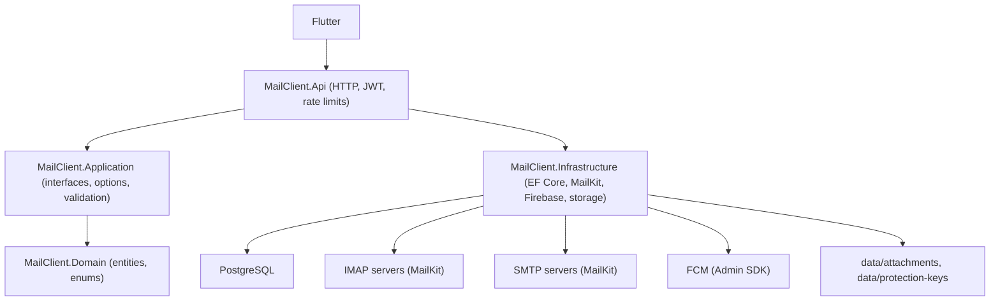
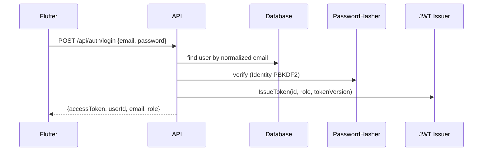
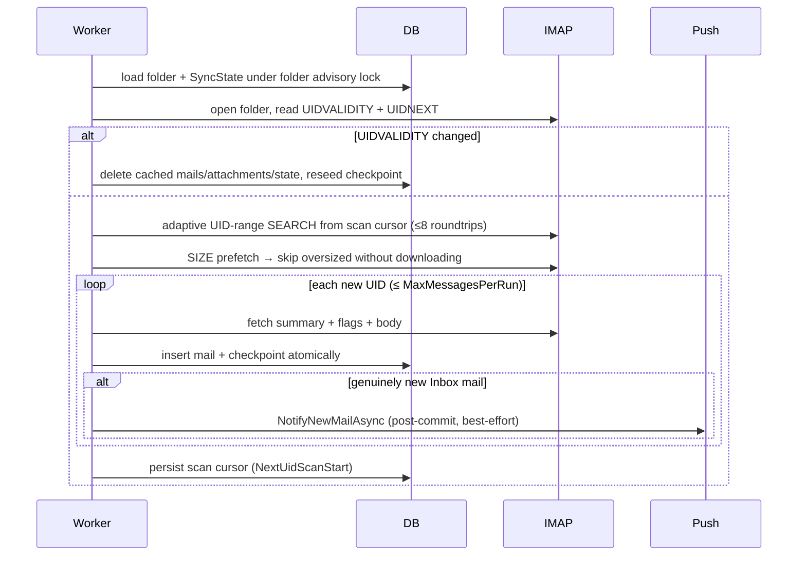
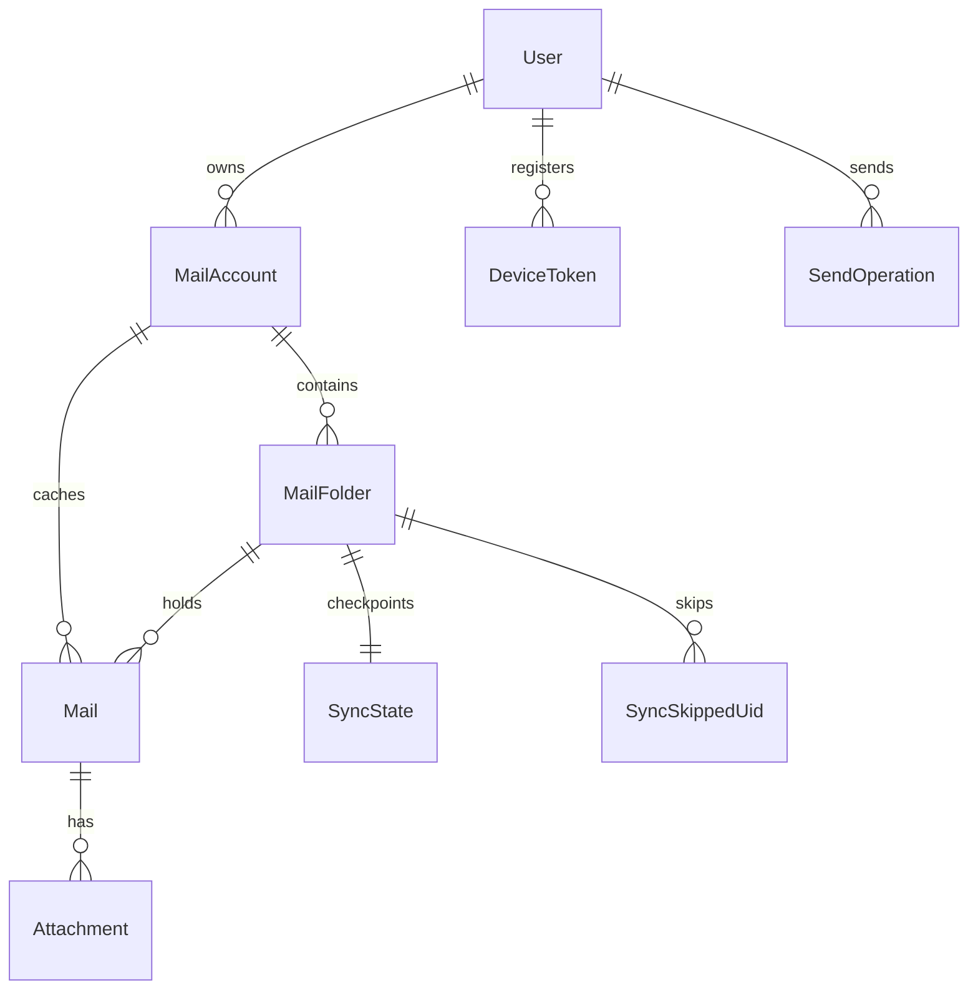

# Backend Guide (English)

> Türkçe sürüm: [BACKEND_GUIDE.tr.md](BACKEND_GUIDE.tr.md) ·
> Detail companions: [ARCHITECTURE.en.md](ARCHITECTURE.en.md) ·
> [API_REFERENCE.en.md](API_REFERENCE.en.md) ·
> [DEVELOPMENT.en.md](DEVELOPMENT.en.md) · [SECURITY.en.md](SECURITY.en.md)

This guide goes from "what is this?" to implementation internals.
Code under `backend/src` is the source of truth.

---

## 1. Project overview

**Mail Client** is a Flutter + ASP.NET Core mail bridge for hosting-provider
email accounts. The Flutter app never talks IMAP/SMTP directly. It calls this
backend over HTTP; the backend:

- stores mail metadata in **PostgreSQL** (via EF Core),
- runs a **background IMAP sync worker** that mirrors server mailboxes locally,
- sends mail through **each user's own SMTP server** (MailKit),
- stores attachment files on **local disk** (`data/attachments`),
- delivers new-mail push via **Firebase Cloud Messaging** (Admin SDK).

### Responsibility split

| Backend owns | Flutter owns |
|---|---|
| Identity, JWT sessions, admin user lifecycle | Login/register UI, token storage, re-login on 401 |
| IMAP/SMTP connections, credential encryption | Never sees mailbox passwords |
| Sync state, UID tracking, flag reconciliation | Renders lists/detail from API DTOs |
| Send idempotency (`SendOperations`) | Generates one `Idempotency-Key` UUID per send tap |
| FCM fan-out, invalid-token pruning | Obtains FCM token, registers it, routes taps to `GET /api/mails/{id}` |
| Rate limiting, SSRF protection, validation | Retries politely (no tight loops) |
| Raw email HTML storage | Treats `bodyHtml` as hostile (no JS, remote resources opt-in) |

### Multi-account concept

One user owns many `MailAccount` rows. Each row holds IMAP+SMTP connection
settings plus a Data-Protection-encrypted mailbox password. Mail is cached
per account → folder → message. The unified list (`GET /api/mails`) can span
accounts; `folderType=Inbox|Sent|...` filters across all of them.

### Technologies used

.NET 10 · ASP.NET Core (minimal APIs, JWT bearer, rate limiting, Data
Protection) · PostgreSQL + EF Core (Npgsql) · MailKit/MimeKit 4.17 ·
FirebaseAdmin 3.6.0 · xUnit + Testcontainers.PostgreSql + GreenMail (tests) ·
GitHub Actions (`ci.yml`, `codeql.yml`) · Swashbuckle (dev Swagger).

---

## 2. High-level architecture



Project references (from the `.csproj` files):

- `MailClient.Api` → `Application`, `Infrastructure`
- `MailClient.Application` → `Domain`
- `MailClient.Infrastructure` → `Application`, `Domain`
- `MailClient.Domain` → nothing (pure entities/enums)

So `Api` exposes HTTP, `Application` declares seams (interfaces, options,
records), `Infrastructure` implements them, `Domain` models data. See
[ARCHITECTURE.en.md](ARCHITECTURE.en.md) for the full reference.

### Repository layout

```text
backend/
├── MailClient.slnx
├── Directory.Build.props          # TreatWarningsAsErrors
├── src/
│   ├── MailClient.Api/            # Program.cs, endpoints, Auth, appsettings*
│   │   ├── Accounts/MailAccountEndpoints.cs
│   │   ├── Mails/MailEndpoints.cs
│   │   ├── Devices/DeviceEndpoints.cs
│   │   ├── Auth/                  # AuthEndpoints, AdminUserEndpoints, JwtTokenIssuer, JwtOptions, DataProtectionSetup
│   │   └── Health/HealthEndpoints.cs
│   ├── MailClient.Application/    # Interfaces/, Auth/PasswordPolicy, Validation/, Network/, Sync/
│   ├── MailClient.Domain/         # Entities/, Enums/
│   └── MailClient.Infrastructure/ # Persistence/, Services/, Email/, Push/, Storage/, Network/, Identity/, Security/, Migrations/
└── tests/
    ├── MailClient.Api.Tests/      # full-stack (WebApplicationFactory + Testcontainers Postgres)
    └── MailClient.Infrastructure.Tests/  # unit (EF InMemory + fakes) + Postgres sync semantics
```

---

## 3. Application startup (`Program.cs`)

### Configuration loading

1. `appsettings.json` (committed; safe defaults, empty secrets).
2. `appsettings.{Environment}.json` (`Development` adds local DB + dev JWT key).
3. **Development only**: `appsettings.Local.json` (git-ignored, optional) then
   environment variables. Production relies on environment variables /
   mounted secrets.

### Service registration (in order)

1. OpenAPI + ProblemDetails; permissive CORS policy `DevelopmentLan`
   (**Development only**).
2. Rate limiter: `auth` (per client IP, 20/min) and `mail-operations`
   (per user, 20/min), `429` on rejection.
3. Swagger with JWT Bearer support (dev UI only).
4. `AppDbContext` (Npgsql, `ConnectionStrings:Default`).
5. `MailSyncOptions` (+ `Validate()` fail-fast); Kestrel max body and
   multipart limit derived from `SendRequestLimits.ComputeMaxRequestBytes`.
6. Attachment root (`MailSync:AttachmentRoot`, default `data/` under content
   root) and Data Protection key ring
   (`DataProtection:KeyPath`, default `data/protection-keys`).
7. `ForwardedHeaders` (X-Forwarded-For/Proto) **only** when
   `Proxy:KnownProxies`/`KnownNetworks` is configured.
8. Mail seams: DNS resolver, outbound host validator, connection helper,
   connectivity tester, folder explorer, credential protector, account/folder/
   read/query/send services, `MailKitMailTransport`, `LocalFileStorage`,
   `MailFolderSyncService`, `MailFolderClient`.
9. Firebase: `FirebaseOptions.Validate()` (fail-fast init when enabled);
   `FirebaseMessageSender` + `FirebaseAdminGateway` +
   `FirebasePushNotificationService`, else `NoOpPushNotificationService`.
10. `DeviceTokenService`; hosted `MailSyncService` (unless
    `MailSync:Enabled=false`); auth/admin/session/health services;
    `JwtTokenIssuer`; `JwtOptions`; Identity `PasswordHasher<User>`.
11. JWT bearer validation (issuer/audience/signing key/lifetime) + fail-fast
    when `Jwt:Key` < 32 chars. `OnTokenValidated` re-checks the session
    (`UserSessionValidator`: user exists, `Active`, `TokenVersion` match) and
    re-issues the role claim from the database: role changes apply to
    already-issued tokens, status/token-version changes kill them.

### Middleware pipeline (real order)

```text
Request
  ↓ ForwardedHeaders (only with trusted proxy config)
  ↓ OpenAPI/Swagger (Development only)
  ↓ ExceptionHandler → ProblemDetails
  ↓ HttpsRedirection (NOT Development, NOT Test)
  ↓ CORS DevelopmentLan (Development only)
  ↓ Authentication → Authorization
  ↓ RateLimiter
  ↓ Endpoints (/health, /api/auth, /api/admin, /api/mail-accounts, /api/mails, /api/devices)
```

---

## 4. Configuration reference

| Setting | Required | Environment | Purpose | Example |
|---|---|---|---|---|
| `ConnectionStrings:Default` | yes | all | PostgreSQL connection | `Host=localhost;Port=5432;Database=PostaKoprusu;Username=postgres;Password=change-me` |
| `Jwt:Issuer` / `Jwt:Audience` | yes | all | token validation | `PostaKoprusu` / `PostaKoprusuClient` |
| `Jwt:Key` | yes (≥32 chars) | all | HMAC signing key; startup throws if short | dev-only value in `appsettings.Development.json` |
| `Registration:Mode` | no (default `ApprovalRequired`) | all | `Open` = active immediately, `ApprovalRequired` = pending, `Disabled` = reject | `ApprovalRequired` |
| `MailSync:Enabled` | no (default true) | all | hosted sync worker on/off | `false` for dev/tests |
| `MailSync:PollIntervalSeconds` | no (30) | all | new-mail poll cadence | `30` |
| `MailSync:FlagSyncIntervalSeconds` | no (120) | all | read-flag reconciliation cadence | `120` |
| `MailSync:MaxMessagesPerRun` | no (100) | all | new-UID bound per folder per poll | `100` |
| `MailSync:MaxAttachmentBytes` | no (25 MiB) | all | per-attachment stored cap | `26214400` |
| `MailSync:MaxMessageAttachmentBytes` | no (50 MiB) | all | per-message attachments cap | `52428800` |
| `MailSync:MaxMessageBytes` | no (100 MiB) | all | SIZE-prefetch download cap (must be ≥ attachment cap) | `104857600` |
| `MailSync:MaxSendBodyChars` | no (1M) | all | per-body send cap | `1000000` |
| `MailSync:AttachmentRoot` | no (`data/`) | all | attachment storage root | `/var/mail-data` |
| `DataProtection:KeyPath` | no (`data/protection-keys`) | all | key-ring directory (must be persistent + shared) | `/var/dp-keys` |
| `DataProtection:CertificatePath` / `CertificatePassword` | prod yes | prod | X509 PFX encrypting the key ring; non-dev startup fails without it | mounted secret path |
| `Firebase:Enabled` | no (false) | all | push on/off | `false` locally |
| `Firebase:ProjectId` | when enabled | all | GCP project id | `my-project-123` |
| `Firebase:CredentialsPath` | no | all | service-account JSON (else `GOOGLE_APPLICATION_CREDENTIALS`, else ADC) | `/secrets/firebase.json` |
| `Proxy:KnownProxies` / `KnownNetworks` | behind proxy | prod | IPs/CIDRs trusted for forwarded headers | `["10.0.0.5"]` / `["10.0.0.0/8"]` |

Validation is fail-fast: bad `MailSync` limits, short JWT key, enabled
Firebase without project/credentials, or non-dev without the Data Protection
certificate all throw at startup.

---

## 5. Secrets management

Never commit: PostgreSQL passwords, `Jwt:Key` (prod), Firebase
service-account JSON, Data Protection PFX/password, mailbox passwords.

- Local overrides: `appsettings.Local.json` (git-ignored template at
  `appsettings.Local.example.json`) or environment variables
  (`ConnectionStrings__Default`, `Jwt__Key`, `Firebase__ProjectId`, ...).
- `.gitignore` blocks: `.env*`, `appsettings.Local.json`, `*.key/*.pfx/*.pem`,
  `firebase-service-account*.json`, `serviceAccountKey.json`,
  `*-firebase-adminsdk-*.json`, `google-services.json`,
  `GoogleService-Info.plist`, `**/data/protection-keys/`,
  `**/data/attachments/`, `secrets/`, `docs/`, `backend/docs/`.
- The backend **service-account JSON** (server credential, full GCP powers)
  and the Flutter **client config** (`google-services.json` /
  `GoogleService-Info.plist`) are different files and **not interchangeable**:
  the former must never ship in the app.

---

## 6. Authentication and authorization

### Registration modes (`Registration:Mode`)

- `Open`: user created `Active`, can log in immediately.
- `ApprovalRequired` (default): user created `Pending`; login returns `403`
  until an admin approves.
- `Disabled`: registration rejected with a validation error.
- `POST /api/auth/register` always returns **`202 Accepted`** with the same
  generic message for new and already-registered addresses (race-safe via the
  `IX_Users_Email` unique index); existence is never disclosed. Invalid
  input still returns `400`.

### Login + JWT



- Email normalized (trim + lowercase); wrong credentials → `401` with a
  generic message; non-`Active` user → `403`.
- Token: `sub` = user id, `role`, `tv` = TokenVersion, 12-hour expiry,
  HMAC-SHA256.
- Every request revalidates the session against the DB. Admin
  approve/disable/enable and password reset **bump `TokenVersion`**, instantly
  invalidating outstanding tokens; clients treat sudden `401` as
  "log in again".
- Roles: `User`, `Admin`. Admin endpoints require `Admin`; admin does not
  bypass mail ownership: all mail queries scope to the caller's `UserId`.
- Passwords: Identity `PasswordHasher<User>`; policy 8-128 chars
  (`PasswordPolicy`); admin create/reset use the same rules. Display names
  ≤ 250 chars, emails ≤ 320.

---

## 7. Mail account management

`MailAccountRequest` (create; update takes the same fields, `password`
optional): `emailAddress`, `displayName`, `username`, `password`,
`imapHost/imapPort/imapSecurity`, `smtpHost/smtpPort/smtpSecurity`,
`saveSentCopy`. Response (`MailAccountResponse`) never includes credentials.

- Validation: email/username ≤ 320, display ≤ 250, mailbox password ≤ 1024,
  ports 1-65535, hosts must be syntactically valid DNS; `MailSecurity.None`
  allowed **only in Development/Test** (else `security` error).
- Hosts pass the SSRF validator (see §12); creation runs IMAP+SMTP
  connectivity checks (`POST …/test` + folder refresh).
- Duplicate `(UserId, EmailAddress)` → `409`, race-safe via unique index.
- Ownership: every operation filters by caller `UserId`; foreign ids → `404`.
- **Reconfiguration rule**: changing IMAP identity (`username`, `imapHost`,
  `imapPort`, `imapSecurity`) resets the cached mailbox (folders, sync state,
  skipped UIDs, mails, attachment metadata + files) under account+folder
  advisory locks, then rediscovers. Changing display name, email address,
  SMTP settings, `saveSentCopy`, or password alone keeps the cache.
- `DELETE` removes the account, all cached rows, and the
  `data/attachments/{accountId}` directory. `IsActive` gates sync selection.

---

## 8. IMAP synchronization

### Beginner view

The hosted worker (`MailSyncService`, every `PollIntervalSeconds`) syncs each
active account's enabled+available folders: new mail is downloaded once and
cached in Postgres; later polls only fetch newer UIDs. Read/unread stays
two-way with the server.

### Internal algorithm (`MailFolderSyncService.SyncFolderCoreAsync`)



Key mechanics:

- **Checkpoints**: `SyncState(LastUid, UidValidity, NextUidScanStart,
  LastNewMailSyncAt, LastFlagSyncAt)`: one row per folder (unique).
- **Sparse-range scan**: exponential UID windows against `UidNext`, max 8
  SEARCH roundtrips; the persisted cursor resumes across polls so huge UID
  gaps converge; `LastUid` advances only over processed mail.
- **Failure policy** (`SyncFailurePolicy`): transient (DB/network/IMAP/IO) →
  abort run, retry same UID next poll. Permanent (malformed/vanished/
  oversized) → record in `SyncSkippedUids` (unique per folder+UID) and skip.
  Unknown errors retry: a wrong retry only delays, a wrong skip loses mail.
- **Flags**: new mail maps `\Seen` → `IsRead` in the same fetch. `PATCH
  /api/mails/{id}/read` sets `\Seen` on the server first, then updates
  the row; UIDVALIDITY change → `409`, both sides untouched. Flag
  reconciliation (every `FlagSyncIntervalSeconds`, FLAGS-only batched fetch)
  imports external flag changes; failures never touch checkpoints.
- **Availability**: folders missing from last discovery are marked
  unavailable. Cached mail stays, but nothing syncs until they reappear.
- **Error isolation**: a failure in one account or folder is only logged; the poll
  continues. Undecryptable credential → error telling the user to re-enter
  the mailbox password.

---

## 9. SMTP sending

`POST /api/mail-accounts/{accountId}/send` (`multipart/form-data`,
`mail-operations` rate limit): `toAddress`, `subject` (truncated to 500),
`bodyHtml` and/or `bodyText` (one required, each ≤ `MaxSendBodyChars`), up to
20 `attachments`. **Mandatory `Idempotency-Key` header (1-200 chars).**

Idempotency state machine (`SendOperations`, unique per user+key,
`pg_advisory_xact_lock` claim + insert-race retry):

```text
(none) --claim--> InProgress --provably-before-send--> FailedBeforeSend --retry--> InProgress
InProgress --SMTP accepted--> Sent --APPEND ok--> SentWithCopy
InProgress --attempted, outcome unknowable--> DeliveryUnknown (terminal, never auto-resends)
```

- Same key + same content fingerprint (SHA-256 over account, recipients,
  subject, bodies, attachment name/type/size/hash) with `Sent/SentWithCopy`
  **replays** the stored result. Same key + different content → `409`.
  `InProgress` (fresh or stale > 5 min) → `409`: a timeout never proves SMTP
  was unattempted, so the app never auto-resends once delivery is possible.
- **SMTP success = sent**: persisted immediately (cancellation-safe) before
  APPEND work. With `SaveSentCopy`, the same `MimeMessage` is IMAP-APPENDed
  to the discovered Sent folder; APPEND failure → `sent:true,
  sentCopySaved:false` + user-presentable warning; client must not resend.
- Kestrel/multipart caps derive from
  `MaxMessageAttachmentBytes + 4·2·MaxSendBodyChars + 1 MiB`, so oversized
  requests are rejected at the edge. Match reverse-proxy limits (~65M
  default).

---

## 10. Attachments

Metadata in `Attachments` (never-exposed `StoragePath` ≤ 1000 chars);
bytes at `data/attachments/{accountId:N}/{mailId:N}/{attachmentId:N}`
(GUID segments, no user input in paths). `LocalFileStorage` pins every path
with `GetFullPath` + root-prefix check (traversal → exception). Download
streams bytes (`Results.File`, no buffering); missing file → controlled 404.
Outgoing filenames/content-types normalized (255/150 chars, safe fallback);
upload streams disposed without extra copies. Account deletion removes the
whole account directory **after** the DB commit. Multi-instance deployments
need shared storage.

---

## 11. Database

PostgreSQL + EF Core. `AppDbContext` applies all configurations from its
assembly. Migrations (6): `InitialMultiAccountSchema`, `AddUserTokenVersion`,
`AddSyncSkippedUids`, `AddSendOperations`, `AddMailFolderAvailability`,
`AddSyncScanCursor`.



Uniqueness: `User.Email`; `(MailAccount.UserId, EmailAddress)`;
`(MailFolder.MailAccountId, FullName)`; `(Mail.FolderId, UidValidity, Uid)`;
`SyncState.MailFolderId`; `(SyncSkippedUid.FolderId, Uid)`;
`DeviceToken.Token`; `(SendOperation.UserId, IdempotencyKey)`.
Secondary index `(Mail.MailAccountId, ReceivedAt)` is what the unified list
reads (`ReceivedAt DESC, Id DESC`, `page ≥ 1`, `1 ≤ pageSize ≤ 100`).

---

## 12. Background sync, push, devices, concurrency

- **Worker**: `MailSyncService` (hosted, `MailSync:Enabled`) → per cycle
  `MailFolderSyncService.SyncAllAsync`: pick active accounts with
  enabled+available folders → per folder take the **folder advisory lock
  before opening IMAP** → re-check account existence under lock (deletion
  wins races) → sync → per-folder errors logged, never abort the cycle.
- **Push** (`FirebasePushNotificationService → IFirebaseGateway →
  FirebaseAdminGateway → IFirebaseMessageSender → FirebaseMessageSender →
  `SendEachAsync`): only genuinely new **Inbox** mail, strictly post-commit in
  a dedicated scope; total transport failure marks all failed-but-kept and
  never throws. Title = sender, body = subject; data =
  `type=new_mail,mailId,accountId,folderId`. Tokens chunk at 500; only
  `MessagingErrorCode.Unregistered` deletes a token (ownership re-checked);
  quota/auth/transient/server failures keep it. `Enabled=false` → safe no-op.
- **Devices**: `POST /api/devices/register` (`pushToken` ≤ 500, `platform`
  android/ios, stored lowercase) is idempotent per token: same-user updates
  in place, cross-user silently reassigns (race-safe via unique index +
  reassign retry). `DELETE /api/devices/{id}` is owner-scoped (`404`
  otherwise). Flutter re-registers on FCM rotation and deletes on logout.
- **Locks**: `pg_advisory_lock` on SHA-256-derived int64 keys:
  account-scoped (`"account:"+id`), folder-scoped (folder id), send-claim
  transaction-scoped (`pg_advisory_xact_lock`), always account → folder order.
  Non-relational (EF InMemory) providers get no-op locks. Discovery commits
  re-check the account fingerprint under the account lock, so a concurrent
  IMAP-identity reset discards stale folder lists (client retries refresh).

---

## 13. Production considerations

Implemented requirements vs recommendations:

| Must (enforced) | Should (operational) |
|---|---|
| Strong `Jwt:Key`, real DB credentials | DB backups, log/monitoring shipping |
| HTTPS + reverse proxy with `Proxy:Known*` | Proxy body limit ≈ 65M (defaults) |
| Data Protection X509 cert + persistent shared key ring | Restrictive file perms on keys/secrets |
| Firebase service-account via secret mount | Shared/persistent `AttachmentRoot` volume |
| `MailSecurity.None` impossible outside dev/test | Single instance unless storage + key ring shared |

---

## 14. Troubleshooting

| Symptom | Likely cause / fix |
|---|---|
| Startup throws `Jwt:Key` | key missing or < 32 chars |
| `MailSync configuration is invalid` | limits break `MaxMessageBytes ≥ MaxMessageAttachmentBytes ≥ MaxAttachmentBytes` or non-positive interval |
| Non-dev startup throws DataProtection | `CertificatePath` missing/unloadable/no private key |
| Firebase startup throws | `ProjectId` empty, credentials path missing/invalid JSON/not service-account/bad private key |
| 503 `/health/db` | Postgres down or connection string wrong |
| Register → can never log in | `Registration:Mode=ApprovalRequired`: admin must approve; `Disabled` rejects |
| Sudden `401` everywhere | admin action bumped `TokenVersion` → log in again |
| `409` on mark-read | folder UIDVALIDITY changed; refresh, retry |
| Sync silent for a folder | folder unavailable (missing from discovery) or sync disabled |
| `sent:true, sentCopySaved:false` | normal: sent, Sent APPEND failed; do not resend |
| Retry returns `409` | key in `InProgress`/`DeliveryUnknown` or content changed; never auto-resend |
| No push | Firebase disabled, no device token, Sent/non-Inbox mail, or transient FCM failure (kept token) |
| LAN refused | wrong IP (DHCP), firewall on 5223, client isolation; check `/health` |
| Swagger 404 | only mapped in Development |

---

## 15. Glossary

**IMAP**: mailbox read protocol; **SMTP**: mail send protocol;
**UID**: per-folder immutable message id; **UIDVALIDITY**: folder
generation counter (change = re-download); **FCM**: Firebase Cloud
Messaging; **ADC**: Application Default Credentials chain;
**JWT**: signed access token (12 h, `sub`/`role`/`tv`);
**SSRF**: server-side request forgery (blocked by host validation);
**Data Protection**: ASP.NET key-ring encryption for mailbox passwords;
**Advisory lock**: Postgres cooperative mutex (`pg_advisory_lock`);
**Idempotency**: same key + same content replays instead of resending;
**MimeMessage**: MailKit/MimeKit mail object; **SyncState**: per-folder
checkpoint row; **TokenVersion**: session generation counter per user.
