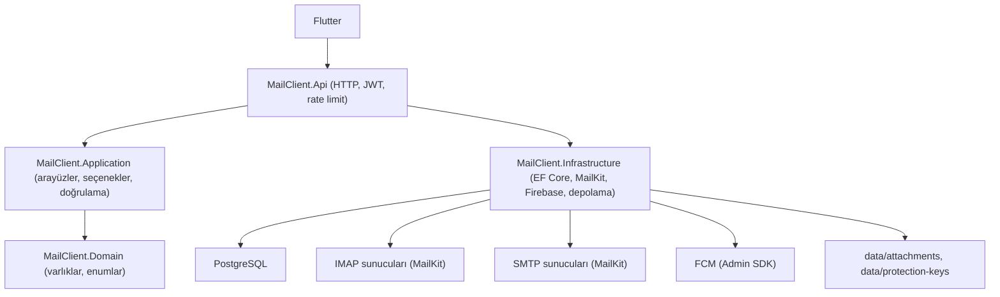
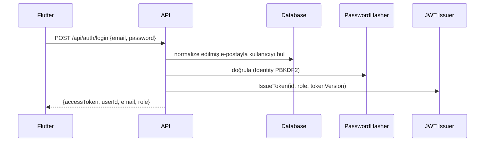
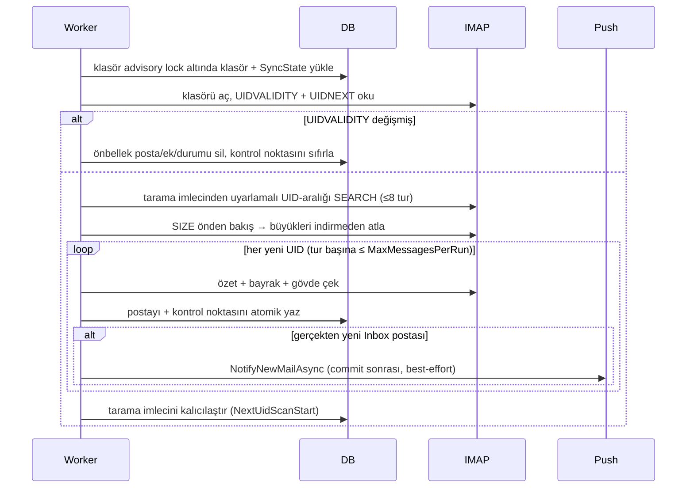
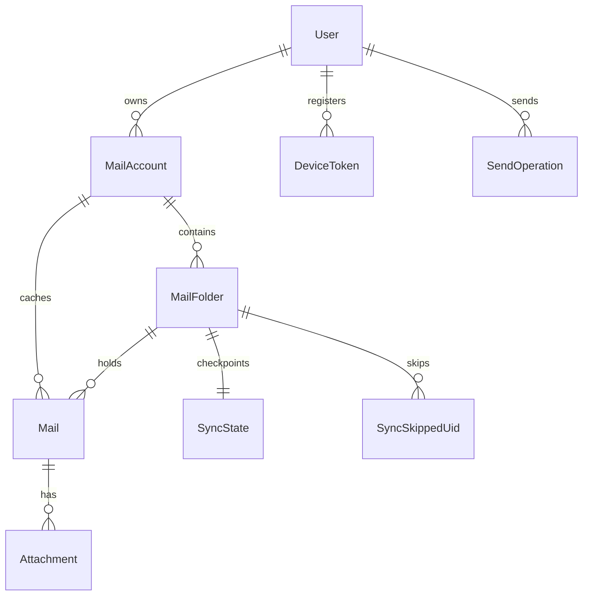

# Backend Kılavuzu (Türkçe)

> English version: [BACKEND_GUIDE.en.md](BACKEND_GUIDE.en.md) ·
> Detay dokümanlar: [ARCHITECTURE.tr.md](ARCHITECTURE.tr.md) ·
> [API_REFERENCE.tr.md](API_REFERENCE.tr.md) ·
> [DEVELOPMENT.tr.md](DEVELOPMENT.tr.md) · [SECURITY.tr.md](SECURITY.tr.md)

Bu kılavuz "bu nedir?" sorusundan implementasyon detaylarına ilerler.
Doğruluk kaynağı `backend/src` altındaki koddur.

---

## 1. Proje özeti

**Mail Client**, hosting sağlayıcılarındaki e-posta hesapları için Flutter +
ASP.NET Core tabanlı bir mail köprüsüdür. Flutter uygulaması IMAP/SMTP ile
doğrudan konuşmaz; HTTP üzerinden bu backend'i çağırır. Backend:

- mail metaverisini **PostgreSQL**'de tutar (EF Core),
- sunucu kutularını yerelde aynalayan bir **arka plan IMAP senkron işçisi**
  çalıştırır,
- postaları her kullanıcının **kendi SMTP sunucusu** üzerinden gönderir
  (MailKit),
- ek dosyalarını **yerel diskte** saklar (`data/attachments`),
- yeni posta bildirimlerini **Firebase Cloud Messaging** ile iletir
  (Admin SDK).

### Sorumluluk dağılımı

| Backend yapar | Flutter yapar |
|---|---|
| Kimlik, JWT oturumları, admin kullanıcı yönetimi | Login/register arayüzü, token saklama, 401'de yeniden giriş |
| IMAP/SMTP bağlantıları, parola şifreleme | Kutu parolalarını hiç görmez |
| Senkron durumu, UID takibi, bayrak uzlaşması | API DTO'larından liste/detay çizer |
| Gönderim idempotency'si (`SendOperations`) | Gönderim başına tek `Idempotency-Key` UUID üretir |
| FCM dağıtımı, geçersiz token temizliği | FCM token alır, kaydeder, dokunuşta `GET /api/mails/{id}` çağırır |
| Rate limiting, SSRF koruması, doğrulama | Kibar retry (sıkı döngü yok) |
| Ham e-posta HTML'ini saklar | `bodyHtml`'i düşmanca kabul eder (JS yok, uzak kaynaklar isteğe bağlı) |

### Çoklu hesap kavramı

Bir kullanıcı birden çok `MailAccount` satırına sahiptir. Her satır IMAP+SMTP
bağlantı ayarlarını ve Data Protection ile şifrelenmiş kutu parolasını tutar.
Posta hesap → klasör → mesaj olarak önbelleğe alınır. Birleşik liste
(`GET /api/mails`) hesaplar arası çalışır; `folderType=Inbox|Sent|...` ile
filtrelenir.

### Kullanılan teknolojiler

.NET 10 · ASP.NET Core (minimal API, JWT bearer, rate limiting, Data
Protection) · PostgreSQL + EF Core (Npgsql) · MailKit/MimeKit 4.17 ·
FirebaseAdmin 3.6.0 · xUnit + Testcontainers.PostgreSql + GreenMail (test) ·
GitHub Actions (`ci.yml`, `codeql.yml`) · Swashbuckle (dev Swagger).

---

## 2. Üst düzey mimari



Proje referansları (`.csproj` dosyalarından):

- `MailClient.Api` → `Application`, `Infrastructure`
- `MailClient.Application` → `Domain`
- `MailClient.Infrastructure` → `Application`, `Domain`
- `MailClient.Domain` → hiçbir şey (saf varlık/enum katmanı)

`Api` HTTP'yi açar, `Application` dikişleri tanımlar (arayüz, seçenek,
record), `Infrastructure` bunları gerçekler, `Domain` veriyi modeller. Tam
referans için [ARCHITECTURE.tr.md](ARCHITECTURE.tr.md).

### Dizin yapısı

```text
backend/
├── MailClient.slnx
├── Directory.Build.props          # TreatWarningsAsErrors
├── src/
│   ├── MailClient.Api/            # Program.cs, uç noktalar, Auth, appsettings*
│   │   ├── Accounts/MailAccountEndpoints.cs
│   │   ├── Mails/MailEndpoints.cs
│   │   ├── Devices/DeviceEndpoints.cs
│   │   ├── Auth/                  # AuthEndpoints, AdminUserEndpoints, JwtTokenIssuer, JwtOptions, DataProtectionSetup
│   │   └── Health/HealthEndpoints.cs
│   ├── MailClient.Application/    # Interfaces/, Auth/PasswordPolicy, Validation/, Network/, Sync/
│   ├── MailClient.Domain/         # Entities/, Enums/
│   └── MailClient.Infrastructure/ # Persistence/, Services/, Email/, Push/, Storage/, Network/, Identity/, Security/, Migrations/
└── tests/
    ├── MailClient.Api.Tests/      # uçtan uca (WebApplicationFactory + Testcontainers Postgres)
    └── MailClient.Infrastructure.Tests/  # birim (EF InMemory + fake) + Postgres senkron testleri
```

---

## 3. Uygulama başlatma (`Program.cs`)

### Yapılandırma yükleme

1. `appsettings.json` (repoda; güvenli varsayılanlar, sır yok).
2. `appsettings.{Environment}.json` (`Development` yerel DB + dev JWT anahtarı ekler).
3. **Yalnızca Development**: `appsettings.Local.json` (git'te yok, opsiyonel),
   sonra ortam değişkenleri. Production ortam değişkenleri / mount edilmiş
   sırlara dayanır.

### Servis kayıtları (sırayla)

1. OpenAPI + ProblemDetails; `DevelopmentLan` CORS politikası (**yalnızca
   Development**).
2. Rate limiter: `auth` (istemci IP başına 20/dk) ve `mail-operations`
   (kullanıcı başına 20/dk), aşımda `429`.
3. JWT Bearer destekli Swagger (yalnızca dev arayüzü).
4. `AppDbContext` (Npgsql, `ConnectionStrings:Default`).
5. `MailSyncOptions` (+ fail-fast `Validate()`); Kestrel gövde limiti ve
   multipart limiti `SendRequestLimits.ComputeMaxRequestBytes`'tan türetilir.
6. Ek kökü (`MailSync:AttachmentRoot`, varsayılan content root altında
   `data/`) ve Data Protection anahtar halkası (`DataProtection:KeyPath`,
   varsayılan `data/protection-keys`).
7. `ForwardedHeaders` (X-Forwarded-For/Proto) **yalnızca**
   `Proxy:KnownProxies`/`KnownNetworks` yapılandırılmışsa.
8. Mail dikişleri: DNS çözümleyici, outbound host doğrulayıcı, bağlantı
   yardımcısı, bağlantı test edici, klasör gezgini, parola koruyucu,
   hesap/klasör/okuma/sorgu/gönderim servisleri, `MailKitMailTransport`,
   `LocalFileStorage`, `MailFolderSyncService`, `MailFolderClient`.
9. Firebase: `FirebaseOptions.Validate()` (etkinse fail-fast init);
   `FirebaseMessageSender` + `FirebaseAdminGateway` +
   `FirebasePushNotificationService`, yoksa `NoOpPushNotificationService`.
10. `DeviceTokenService`; `MailSync:Enabled` ise hosted `MailSyncService`;
    auth/admin/oturum/sağlık servisleri; `JwtTokenIssuer`; `JwtOptions`;
    Identity `PasswordHasher<User>`.
11. JWT bearer doğrulama (issuer/audience/imza anahtarı/süre) + `Jwt:Key` 32
    karakterden kısaysa fail-fast. `OnTokenValidated` oturumu DB'ye karşı
  yeniden doğrular (`UserSessionValidator`: kullanıcı var, `Active`,
  `TokenVersion` eşleşiyor) ve rol claim'ini veritabanından yeniden
  yazar: rol değişikliği eski tokenlara yansır, statü/token-versiyon
    değişikliği tokenları öldürür.

### Middleware hattı (gerçek sıra)

```text
İstek
  ↓ ForwardedHeaders (yalnızca güvenilir proxy yapılandırması varsa)
  ↓ OpenAPI/Swagger (yalnızca Development)
  ↓ ExceptionHandler → ProblemDetails
  ↓ HttpsRedirection (Development ve Test hariç)
  ↓ CORS DevelopmentLan (yalnızca Development)
  ↓ Authentication → Authorization
  ↓ RateLimiter
  ↓ Uç noktalar (/health, /api/auth, /api/admin, /api/mail-accounts, /api/mails, /api/devices)
```

---

## 4. Yapılandırma referansı

| Ayar | Zorunlu | Ortam | Amaç | Örnek |
|---|---|---|---|---|
| `ConnectionStrings:Default` | evet | hepsi | PostgreSQL bağlantısı | `Host=localhost;Port=5432;Database=PostaKoprusu;Username=postgres;Password=change-me` |
| `Jwt:Issuer` / `Jwt:Audience` | evet | hepsi | token doğrulama | `PostaKoprusu` / `PostaKoprusuClient` |
| `Jwt:Key` | evet (≥32 karakter) | hepsi | HMAC imza anahtarı; kısaysa başlatmada hata | dev değeri `appsettings.Development.json`'da |
| `Registration:Mode` | hayır (varsayılan `ApprovalRequired`) | hepsi | `Open` = hemen aktif, `ApprovalRequired` = onay bekler, `Disabled` = reddeder | `ApprovalRequired` |
| `MailSync:Enabled` | hayır (varsayılan true) | hepsi | senkron işçisi aç/kapa | dev/test için `false` |
| `MailSync:PollIntervalSeconds` | hayır (30) | hepsi | yeni posta tarama sıklığı | `30` |
| `MailSync:FlagSyncIntervalSeconds` | hayır (120) | hepsi | okundu bayrağı uzlaşma sıklığı | `120` |
| `MailSync:MaxMessagesPerRun` | hayır (100) | hepsi | tur başına klasör başına yeni UID üst sınırı | `100` |
| `MailSync:MaxAttachmentBytes` | hayır (25 MiB) | hepsi | ek başına saklama üst sınırı | `26214400` |
| `MailSync:MaxMessageAttachmentBytes` | hayır (50 MiB) | hepsi | mesaj başına ek toplamı üst sınırı | `52428800` |
| `MailSync:MaxMessageBytes` | hayır (100 MiB) | hepsi | SIZE önden bakış indirme sınırı (ek sınırından küçük olamaz) | `104857600` |
| `MailSync:MaxSendBodyChars` | hayır (1M) | hepsi | gönderimde gövde başına karakter sınırı | `1000000` |
| `MailSync:AttachmentRoot` | hayır (`data/`) | hepsi | ek depolama kökü | `/var/mail-data` |
| `DataProtection:KeyPath` | hayır (`data/protection-keys`) | hepsi | anahtar halkası dizini (kalıcı + paylaşımlı olmalı) | `/var/dp-keys` |
| `DataProtection:CertificatePath` / `CertificatePassword` | prod'da evet | prod | halka şifreleyen X509 PFX; dev dışı başlatma yokluğunda hata verir | mount edilmiş sır yolu |
| `Firebase:Enabled` | hayır (false) | hepsi | push aç/kapa | yerelde `false` |
| `Firebase:ProjectId` | etkinken | hepsi | GCP proje kimliği | `my-project-123` |
| `Firebase:CredentialsPath` | hayır | hepsi | servis hesabı JSON'u (yoksa `GOOGLE_APPLICATION_CREDENTIALS`, yoksa ADC) | `/secrets/firebase.json` |
| `Proxy:KnownProxies` / `KnownNetworks` | proxy arkasındaysa | prod | forwarded header için güvenilen IP/CIDR | `["10.0.0.5"]` / `["10.0.0.0/8"]` |

Doğrulama fail-fast'tir: bozuk `MailSync` limitleri, kısa JWT anahtarı,
projesiz/parolasız etkin Firebase veya dev dışında X509'suz başlatma
başlatmada hata verir.

---

## 5. Sır yönetimi

Asla commit edilmez: PostgreSQL parolaları, `Jwt:Key` (prod), Firebase servis
hesabı JSON'u, Data Protection PFX/parolası, kutu parolaları.

- Yerel geçersiz kılma: `appsettings.Local.json` (git'te yok; şablon
  `appsettings.Local.example.json`) veya ortam değişkenleri
  (`ConnectionStrings__Default`, `Jwt__Key`, `Firebase__ProjectId`, ...).
- `.gitignore` engeller: `.env*`, `appsettings.Local.json`, `*.key/*.pfx/*.pem`,
  `firebase-service-account*.json`, `serviceAccountKey.json`,
  `*-firebase-adminsdk-*.json`, `google-services.json`,
  `GoogleService-Info.plist`, `**/data/protection-keys/`,
  `**/data/attachments/`, `secrets/`, `docs/`, `backend/docs/`.
- Backend **servis hesabı JSON'u** (sunucu kimliği, tam GCP yetkisi) ile
  Flutter **istemci yapılandırması** (`google-services.json` /
  `GoogleService-Info.plist`) farklı dosyalardır ve **birbirinin yerine
  geçmez**: servis hesabı asla uygulamaya gömülmez.

---

## 6. Kimlik doğrulama ve yetkilendirme

### Kayıt modları (`Registration:Mode`)

- `Open`: kullanıcı `Active` doğar, hemen giriş yapabilir.
- `ApprovalRequired` (varsayılan): kullanıcı `Pending` doğar; admin onayı
  olmadan login `403` döner.
- `Disabled`: kayıt doğrulama hatasıyla reddedilir.
- `POST /api/auth/register` yeni ve kayıtlı adresler için hep aynı
  **`202 Accepted`** genel mesajını döner (`IX_Users_Email` unique index'i
  ile yarış güvenli); adres varlığı dışarı sızmaz. Geçersiz girdi yine
  `400` döner.

### Giriş + JWT



- E-posta normalize edilir (kırp + küçük harf); yanlış kimlik → genel
  mesajlı `401`; `Active` olmayan kullanıcı → `403`.
- Token: `sub` = kullanıcı id, `role`, `tv` = TokenVersion, 12 saat ömür,
  HMAC-SHA256.
- Her istek oturumu DB'ye karşı yeniden doğrular. Admin
  onay/kapama/açma ve parola sıfırlama **`TokenVersion`'ı artırır**,
  dolaşımdaki tokenları anında öldürür; istemci ani `401`'i "yeniden giriş
  yap" olarak yorumlar.
- Roller: `User`, `Admin`. Admin uçları `Admin` ister; admin posta
  sahipliğini atlamaz: tüm posta sorguları çağıranın `UserId`'sine
  filtrelenir.
- Parolalar: Identity `PasswordHasher<User>`; politika 8-128 karakter
  (`PasswordPolicy`); admin oluşturma/sıfırlama aynı kuralları kullanır.
  Görünen ad ≤ 250, e-posta ≤ 320 karakter.

---

## 7. Posta hesabı yönetimi

`MailAccountRequest` (oluşturma; güncelleme aynı alanlar, `password`
opsiyonel): `emailAddress`, `displayName`, `username`, `password`,
`imapHost/imapPort/imapSecurity`, `smtpHost/smtpPort/smtpSecurity`,
`saveSentCopy`. Yanıt (`MailAccountResponse`) asla parola içermez.

- Doğrulama: e-posta/kullanıcı adı ≤ 320, görünen ad ≤ 250, kutu parolası ≤
  1024, port 1-65535, host geçerli DNS olmalı; `MailSecurity.None`
  **yalnızca Development/Test'te** izinli (yoksa `security` hatası).
- Hostlar SSRF doğrulayıcıdan geçer (§12); oluşturma IMAP+SMTP bağlantı
  testleri çalıştırır (`POST …/test` + klasör keşfi).
- Yinelenen `(UserId, EmailAddress)` → `409`, unique index ile yarış güvenli.
- Sahiplik: her işlem çağıran `UserId`'ye filtrelenir; yabancı id → `404`.
- **Yeniden yapılandırma kuralı**: IMAP kimliği değişirse (`username`,
  `imapHost`, `imapPort`, `imapSecurity`) önbellekteki kutu account+folder
  advisory lock'ları altında sıfırlanır (klasörler, senkron durumu, atlanan
  UID'ler, postalar, ek metaverisi + dosyalar), sonra yeniden keşfedilir. Yalnızca görünen ad, e-posta adresi, SMTP ayarları,
  `saveSentCopy` veya parola değişirse önbellek korunur.
- `DELETE` hesabı, tüm önbellek satırlarını ve `data/attachments/{accountId}`
  dizinini siler. `IsActive` senkron seçimini belirler.

---

## 8. IMAP senkronizasyonu

### Yeni başlayan bakışı

Hosted işçi (`MailSyncService`, her `PollIntervalSeconds`) aktif hesapların
etkin+kullanılabilir klasörlerini senkronlar: yeni posta bir kez indirilip
Postgres'e önbelleğe alınır; sonraki turlar yalnızca daha yeni UID'leri
çeker. Okundu bilgisi sunucuyla çift yönlü tutulur.

### İç algoritma (`MailFolderSyncService.SyncFolderCoreAsync`)



Temel mekanikler:

- **Kontrol noktaları**: klasör başına tek satır
  `SyncState(LastUid, UidValidity, NextUidScanStart, LastNewMailSyncAt,
  LastFlagSyncAt)` (unique).
- **Seyrek aralık taraması**: `UidNext`'e karşı üstel büyüyen UID pencereleri,
  en fazla 8 SEARCH turu; kalıcı imleç turlar arası kaldığı yerden devam
  eder, dev UID boşlukları yakınsar; `LastUid` yalnızca işlenen postada ilerler.
- **Hata politikası** (`SyncFailurePolicy`): geçici (DB/ağ/IMAP/IO) → turu
  iptal et, aynı UID'yi sonraki turda dene. Kalıcı (bozuk/kaybolmuş/aşırı
  büyük) → `SyncSkippedUids`'e yaz (klasör+UID başına unique) ve geç.
  Bilinmeyen hata retry eder: yanlış retry yalnızca geciktirir, yanlış skip
  posta kaybettirir.
- **Bayraklar**: yeni posta `\Seen` → `IsRead` eşlemesini aynı çekişte yapar.
  `PATCH /api/mails/{id}/read` önce sunucuda `\Seen`'i değiştirir, sonra
  satırı günceller; UIDVALIDITY değişmişse `409`, iki taraf da değişmez.
  Bayrak uzlaşması (`FlagSyncIntervalSeconds`'te bir, yalnızca FLAGS toplu
  çekiş) dışarıdaki bayrak değişimlerini içeri alır; hatalar kontrol
  noktalarına dokunmaz.
- **Kullanılabilirlik**: son keşifte görünmeyen klasörler kullanılamaz
  işaretlenir. Postaları durur ama yeniden görünene dek senkronlanmaz.
- **Hata yalıtımı**: tek hesap veya klasördeki hata yalnızca loglanır; tur
  devam eder. Çözülemeyen parola → kullanıcıya kutu parolasını yeniden girmesini
  söyleyen hata.

---

## 9. SMTP gönderimi

`POST /api/mail-accounts/{accountId}/send` (`multipart/form-data`,
`mail-operations` limiti): `toAddress`, `subject` (500 karaktere kırpılır),
`bodyHtml` ve/veya `bodyText` (biri zorunlu, her biri ≤ `MaxSendBodyChars`),
en fazla 20 `attachments`. **`Idempotency-Key` başlığı zorunlu (1-200 karakter).**

Idempotency durum makinesi (`SendOperations`, kullanıcı+anahtar başına
unique, `pg_advisory_xact_lock` claim + insert-yarışı tekrarı):

```text
(yok) --claim--> InProgress --kanıtlı-gönderim-öncesi--> FailedBeforeSend --retry--> InProgress
InProgress --SMTP kabul--> Sent --APPEND ok--> SentWithCopy
InProgress --denendi, sonuç bilinemez--> DeliveryUnknown (son, asla otomatik yeniden göndermez)
```

- Aynı anahtar + aynı içerik parmak izi (hesap, alıcılar, konu, gövdeler, ek
  ad/tip/boyut/hash üzerinden SHA-256), `Sent/SentWithCopy` ise **kayıtlı
  sonucu tekrar oynatır**. Aynı anahtar + farklı içerik → `409`.
  `InProgress` (taze veya 5 dk'dan eski) → `409`: zaman aşımı SMTP'nin
  denenmediğini kanıtlamaz, uygulama gönderim ihtimali doğunca asla otomatik
  yeniden göndermez.
- **SMTP başarısı = gönderildi**: iptal-güvenli şekilde APPEND işinden önce
  kalıcılaştırılır. `SaveSentCopy` açıksa aynı `MimeMessage` keşfedilen Sent
  klasörüne IMAP-APPEND edilir; APPEND hatası → `sent:true,
  sentCopySaved:false` + kullanıcıya gösterilebilir uyarı; istemci yeniden
  göndermemelidir.
- Kestrel/multipart üst sınırları
  `MaxMessageAttachmentBytes + 4·2·MaxSendBodyChars + 1 MiB`'den türetilir,
  büyük istekler uçta reddedilir. Öndeki reverse proxy limitini eşleştirin
  (varsayılanlarla ~65M).

---

## 10. Ekler

Metaveri `Attachments`'ta (`StoragePath` ≤ 1000 karakter, asla dışa verilmez);
baytlar `data/attachments/{accountId:N}/{mailId:N}/{attachmentId:N}` altında
(GUID parçaları, yolda kullanıcı girdisi yok). `LocalFileStorage` her yolu
`GetFullPath` + kök-önek kontrolüyle sabitler (kaçış → hata). İndirme bayt
akışıdır (`Results.File`, tamponlama yok); kayıp dosya → kontrollü 404.
Giden dosya adı/içerik tipi normalize edilir (255/150 karakter, güvenli
yedek); yükleme akışları ek kopyasız kapatılır. Hesap silme önce DB
commit'ini yapar, sonra hesap dizinini kaldırır. Çok örnekli kurulumlarda
paylaşımlı depolama gerekir.

---

## 11. Veritabanı

PostgreSQL + EF Core. `AppDbContext` tüm yapılandırmaları kendi
assembly'sinden uygular. Migration'lar (6): `InitialMultiAccountSchema`,
`AddUserTokenVersion`, `AddSyncSkippedUids`, `AddSendOperations`,
`AddMailFolderAvailability`, `AddSyncScanCursor`.



Tekillikler: `User.Email`; `(MailAccount.UserId, EmailAddress)`;
`(MailFolder.MailAccountId, FullName)`; `(Mail.FolderId, UidValidity, Uid)`;
`SyncState.MailFolderId`; `(SyncSkippedUid.FolderId, Uid)`;
`DeviceToken.Token`; `(SendOperation.UserId, IdempotencyKey)`. İkincil index
`(Mail.MailAccountId, ReceivedAt)` birleşik listenin okuduğu index'tir
(`ReceivedAt DESC, Id DESC`, `page ≥ 1`, `1 ≤ pageSize ≤ 100`).

---

## 12. Arka plan senkronu, push, cihazlar, eşzamanlılık

- **İşçi**: `MailSyncService` (hosted, `MailSync:Enabled`) → her turda
  `MailFolderSyncService.SyncAllAsync`: etkin+uygun klasörü olan aktif
  hesapları seç → klasör başına IMAP açmadan **önce klasör advisory lock** →
  lock altında hesap varlığını yeniden kontrol et (silme yarışları kazanır)
  → senkronla → klasör hataları loglanır, tur asla durmaz.
- **Push** (`FirebasePushNotificationService → IFirebaseGateway →
  FirebaseAdminGateway → IFirebaseMessageSender → FirebaseMessageSender →
  `SendEachAsync`): yalnızca gerçekten yeni **Inbox** postası, kesinlikle
  commit sonrası, ayrı scope'ta; toplam taşıma hatası hepsini
  başarısız-ama-korunmuş işaretler ve asla fırlatmaz. Başlık = gönderen,
  gövde = konu; veri = `type=new_mail,mailId,accountId,folderId`. Tokenlar
  500'li parçalanır; yalnızca `MessagingErrorCode.Unregistered` token
  siler (sahiplik yeniden kontrol edilir); kota/auth/geçici/sunucu hataları
  korur. `Enabled=false` → güvenli no-op.
- **Cihazlar**: `POST /api/devices/register` (`pushToken` ≤ 500, `platform`
  android/ios, küçük harf saklanır) token başına idempotent: aynı kullanıcı
  yerinde günceller, kullanıcılar arası sessizce transfer eder (unique index
  + reassign retry ile yarış güvenli). `DELETE /api/devices/{id}` sahip
  kapsamlıdır (değilse `404`). Flutter FCM rotasyonunda yeniden kaydeder,
  çıkışta siler.
- **Kilitler**: SHA-256 türevi int64 anahtarlarla `pg_advisory_lock`:
  hesap kapsamlı (`"account:"+id`), klasör kapsamlı (klasör id), gönderim
  claim'i işlem kapsamlı (`pg_advisory_xact_lock`), sıra hep hesap → klasör.
  İlişkisel olmayan (EF InMemory) sağlayıcılarda lock no-op'tur. Keşif
  commit'leri hesap parmak izini account lock altında yeniden kontrol eder;
  eşzamanlı IMAP-kimlik sıfırlamasıyla yarışan eski klasör listesi atılır
  (istemci refresh'i tekrarlar).

---

## 13. Production notları

Zorunlu (kodda) vs önerilen (operasyonel):

| Zorunlu | Önerilen |
|---|---|
| Güçlü `Jwt:Key`, gerçek DB kimliği | DB yedekleri, log/izleme |
| HTTPS + `Proxy:Known*` ile reverse proxy | Proxy gövde limiti ≈ 65M (varsayılanlar) |
| Data Protection X509 sertifikası + kalıcı paylaşımlı halka | Anahtar/sırlar için sıkı dosya izinleri |
| Firebase servis hesabı sır mount ile | Paylaşımlı/kalıcı `AttachmentRoot` birimi |
| Dev/test dışında `MailSecurity.None` imkânsız | Depolama + halka paylaşılmadıkça tek örnek |

---

## 14. Sorun giderme

| Belirti | Olası neden / çözüm |
|---|---|
| Başlatmada `Jwt:Key` hatası | anahtar yok veya < 32 karakter |
| `MailSync configuration is invalid` | `MaxMessageBytes ≥ MaxMessageAttachmentBytes ≥ MaxAttachmentBytes` bozulmuş veya pozitif olmayan aralık |
| Dev dışı DataProtection hatası | `CertificatePath` yok/yüklenemiyor/private key yok |
| Firebase başlatma hatası | `ProjectId` boş, parola yolu yok/geçersiz JSON/servis hesabı değil/bozuk private key |
| `/health/db` 503 | Postgres kapalı veya bağlantı cümlesi yanlış |
| Kayıt sonrası giriş yok | `Registration:Mode=ApprovalRequired`: admin onayı gerekli; `Disabled` reddeder |
| Her yerde ani `401` | admin `TokenVersion` artırmış → yeniden giriş |
| Okundu işaretlemede `409` | klasör UIDVALIDITY değişmiş; yenile, tekrar dene |
| Klasör sessizce senkronlanmıyor | klasör kullanılamaz (keşifte yok) veya senkron kapalı |
| `sent:true, sentCopySaved:false` | normal: gönderildi, Sent APPEND başarısız; yeniden gönderme |
| Retry'de `409` | anahtar `InProgress`/`DeliveryUnknown` veya içerik değişmiş; asla otomatik yeniden gönderme |
| Push gelmiyor | Firebase kapalı, cihaz token yok, Sent/Inbox-dışı posta veya geçici FCM hatası (token korunur) |
| LAN reddi | yanlış IP (DHCP), 5223'te güvenlik duvarı, istemci izolasyonu; `/health` kontrol et |
| Swagger 404 | yalnızca Development'te map edilir |

---

## 15. Sözlük

**IMAP**: kutu okuma protokolü; **SMTP**: posta gönderme protokolü;
**UID**: klasör içi değişmez mesaj kimliği; **UIDVALIDITY**: klasör nesil
sayacı (değişirse yeniden indirilir); **FCM**: Firebase Cloud Messaging;
**ADC**: Application Default Credentials zinciri; **JWT**: imzalı erişim
tokenı (12 saat, `sub`/`role`/`tv`); **SSRF**: sunucu taraflı istek sahteciliği
(host doğrulamayla engellenir); **Data Protection**: kutu parolaları için
ASP.NET anahtar halkası şifrelemesi; **Advisory lock**: Postgres işbirlikçi
kilidi (`pg_advisory_lock`); **Idempotency**: aynı anahtar + aynı içerik
yeniden göndermek yerine tekrar oynatır; **MimeMessage**: MailKit/MimeKit
posta nesnesi; **SyncState**: klasör başına kontrol noktası satırı;
**TokenVersion**: kullanıcı başına oturum nesil sayacı.
